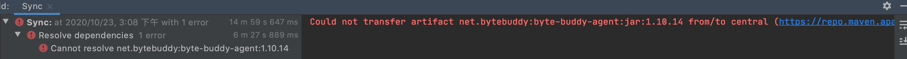
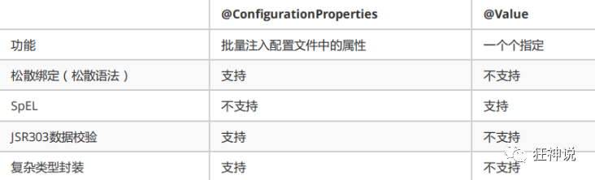
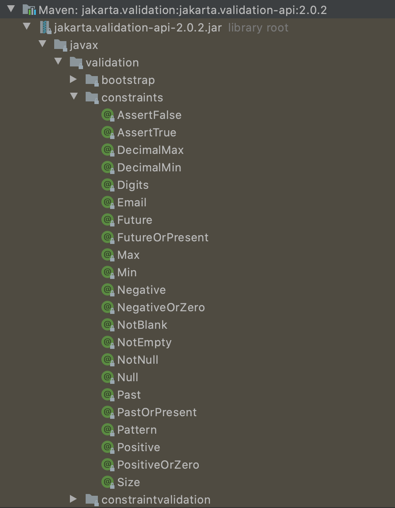
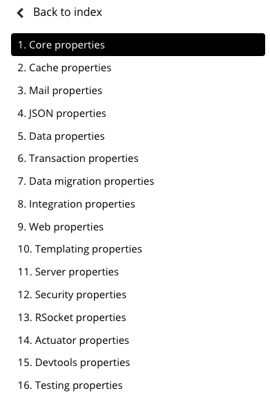

SpringBoot


# 1 第一个SpringBoot程序！

环境：

jdk1.8

maven：

springboot：2.3.4

idea 2020.1


两种创建基于maven的springboot项目


方式1：

1、登陆官网https://spring.io/projects/spring-boot#overview


2、点击[Spring Initializr](https://start.spring.io/) 进入 (`https://start.spring.io/`)


3、红色箭头是特别需要注意的，方框是填完后直接生成springboot项目

4、打开本地idea，选择项目文件，选择导入（2020.1无需其他操作），等待项目下载依赖！


2.3.4有如下问题，我尝试设置从阿里仓库获取，还是红色！




```java
Could not transfer artifact net.bytebuddy:byte-buddy-agent:jar:1.10.14 from/to central (https://repo.maven.apache.org/maven2): Transfer failed for https://repo.maven.apache.org/maven2/net/bytebuddy/byte-buddy-agent/1.10.14/byte-buddy-agent-1.10.14.jar
```


虽然有包没有导入，但是可以正常运行！


打jar包


执行jar包


结果


mac上部署的jar，让它结束运行！

```linux
ps aux|grep helloworld-0.0.1-SNAPSHOT.jar

kill -9 24749
```


**当我重新打开idea！tmd没有红色了，贼舒服！**


方法2：使用idea，选择Spring Initializr后从官网获取


在显示生成banner的网站！

https://www.bootschool.net/ascii


原理初探

在pom.xml中，父工程parent中点击2.3.4.RELEASE，就会看到如下依赖，它是spring-boot的核心依赖！

```
spring-boot-dependencies
```

在spring-boot中引入依赖的时候，不需要指定版本，就是因为对应的springboot中有对应的版本version


启动器，也就是springboot的启动场景

```xml
<dependency>
    <groupId>org.springframework.boot</groupId>
    <artifactId>spring-boot-starter</artifactId>
</dependency>
```

比如：spring-boot-start-web，他就会帮我们自动导入web环境所有的依赖

springboot会将所有的功能场景，都变成一个个的启动器

我们要使用什么功能，我们就找到对应的启动器就可以了`starter`


主程序

```java
// @SpringBootApplication : 标注这个类是一个Springboot的应用
@SpringBootApplication
public class Springboot01HelloworldApplication {
    public static void main(String[] args) {
        // 将springboot应用启动
        SpringApplication.run(Springboot01HelloworldApplication.class, args);
    }
}
```


@SpringBootApplication里面的两个重要注解：

```java
@SpringBootConfiguration: springboot的配置，本质也是一个spring组件

@EnableAutoConfiguration: 自动配置
```


 


# 2 SpringBoot配置

application.properties中可以有哪些配置？

可以参见这个文档[Common Application properties](https://docs.spring.io/spring-boot/docs/current/reference/html/appendix-application-properties.html#common-application-properties)


官方文档配置太多，需要了解原理。

官方推荐yaml文件格式，不建议使用properties文件，所以建议删掉重新建一个（因为peoperties只能存键值对，yaml存储的类型可以是键值对、对象、数组等）

```yaml
# 可以注入到相应的类中，也就是java中不设置值，通过这里注入，和spring中使用xml注入类似
# 普通的k-v
name: liyang

# 对象
student:
  name: liyang
  age: 18

# 对象的行内写法
person: {name: ly, age: 18}

# 数组
pets:
  - cat
  - dog
  - tiger

animals: [bird, lion, dolphin]
```


Configuring the Annotation Processor

To use the processor, include a dependency on `spring-boot-configuration-processor`.

With Maven the dependency should be declared as optional, as shown in the following example:

```xml
<dependency>
    <groupId>org.springframework.boot</groupId>
    <artifactId>spring-boot-configuration-processor</artifactId>
    <optional>true</optional>
</dependency>
```


我们上面采用的yaml方法都是最简单的方式，开发中最常用的；也是springboot所推荐的！那我们来唠唠其他的实现方式，道理都是相同的；写还是那样写；配置文件除了yml还有我们之前常用的properties ， 我们没有讲，我们来唠唠！

【注意】properties配置文件在写中文的时候，会有乱码 ， 我们需要去IDEA中设置编码格式为UTF-8；


其他注入方式

```java
@Component //注册bean
@ConfigurationProperties(prefix = "users")
public class User {
    //直接使用@value
    @Value("${users.name}") // 从配置文件中取值，因为配置的@ConfigurationProperties，可以让其自动装配，因此可以省略
    private String name;
    @Value("#{9 * 2}")     // #{SPEL} Spring表达式
    private int age;
    @Value("男")           // 字面量
    private String sex;

    public User() {
    }

    public User(String name, int age, String sex) {
        this.name = name;
        this.age = age;
        this.sex = sex;
    }

    public String getName() {
        return name;
    }

    public void setName(String name) {
        this.name = name;
    }

    public int getAge() {
        return age;
    }

    public void setAge(int age) {
        this.age = age;
    }

    public String getSex() {
        return sex;
    }

    public void setSex(String sex) {
        this.sex = sex;
    }

    @Override
    public String toString() {
        return "User{" +
                "name='" + name + '\'' +
                ", age=" + age +
                ", sex='" + sex + '\'' +
                '}';
    }
}
```

注意这里，prefix使用users定位yaml文件中的users，因为在META-INF下有一个红框文件，里面的内容有user.name这个字段，它会获取本机的user名字，导致自己的设置值不生效，所以使用users来对应yaml文件中的users，避免出现问题。

	

```json
{
  "properties": [
    {
      "name": "user.name",
      "type": "java.lang.String",
      "description": "Description for user.name."
  }
] }
```

另外，在配置的时候不要重复配置，因为存在优先级问题，所以有些使用@Value设定的会被yaml文件中的设定给覆盖！


yaml支持松散绑定，就是yaml中的first-name可以对应到类中的firstName。

yaml文件内容

```yaml
person:
  name: liyang
  age: 18
  happy: false
  birth: 2002/01/01
  maps: {k1: v1,k2: v2}
  lists:
    - code
    - game
    - music
  dog:
    name: 旺旺
    age: 1

users:
  name: god


student:
  first-name: yang
  last-name: li
```


**对比小结**

@Value这个使用起来并不友好！我们需要为每个属性单独注解赋值，比较麻烦；我们来看个功能对比图




*   @ConfigurationProperties只需要写一次即可 ， @Value则需要每个字段都添加
*   松散绑定：这个什么意思呢? 比如我的yml中写的last-name，这个和lastName是一样的， - 后面跟着的字母默认是大写的。这就是松散绑定。可以测试一下
*   JSR303数据校验 ， 这个就是我们可以在字段是增加一层过滤器验证 ， 可以保证数据的合法性
*   复杂类型封装，yml中可以封装对象 ， 使用value就不支持

**结论：**

*   配置yml和配置properties都可以获取到值 ， 强烈推荐 yml；
*   如果我们在某个业务中，只需要获取配置文件中的某个值，可以使用一下 @value；
*   如果说，我们专门编写了一个JavaBean来和配置文件进行一一映射，就直接@configurationProperties，不要犹豫！


# 3 JRS303校验


使用@Validate后，使用@Email的时候会报错，在pom.xml导入如下包

```xml
<dependency>
    <groupId>org.springframework.boot</groupId>
    <artifactId>spring-boot-starter-validation</artifactId>
</dependency>
```


在email加上注解@Email()，括号内的提示内容可以为空，写上更好，这样出错很容易看到是哪里错了！

```java
package com.ly.pojo;

import lombok.Data;
import org.springframework.boot.context.properties.ConfigurationProperties;
import org.springframework.stereotype.Component;
import org.springframework.validation.annotation.Validated;

import javax.validation.constraints.Email;

@Data
@Component // 注册bean
@ConfigurationProperties(prefix = "student")
@Validated // 数据校验
public class Student {
    private String firstName;
    private String lastName;
    @Email(message="邮箱格式错误") //name必须是邮箱格式
    private String email;
}
```


在application.yaml文件中注入的student信息如下

```yaml
student:
  first-name: yang
  last-name: li
  email: 12306
```


测试程序（关注student即可，其它为前面的测试代码）

```java
package com.ly;

import com.ly.pojo.Dog;
import com.ly.pojo.Person;
import com.ly.pojo.Student;
import com.ly.pojo.User;
import org.junit.jupiter.api.Test;
import org.springframework.beans.factory.annotation.Autowired;
import org.springframework.boot.test.context.SpringBootTest;


/**
 * liyang 2020-10-24
 * 测试springboot的两种注入方式
 */
@SpringBootTest
class Springboot02ConfigApplicationTests {

    @Autowired
    private Dog dog;

    @Autowired
    private Person person;

    @Autowired
    private User user;

    @Autowired
    private Student stu;

    @Test
    void contextLoads() {
        System.out.println(dog);
        System.out.println(person);
        System.out.println(user);
        System.out.println(stu);
    }

}
```


测试结果：因为邮箱在注入的时候没有按照邮箱格式，@Email()校验这个字段，并提示我们哪里出错！


**使用数据校验，可以保证数据的正确性** 

常见参数

```java

@NotNull(message="名字不能为空")
private String userName;
@Max(value=120,message="年龄最大不能查过120")
private int age;
@Email(message="邮箱格式错误")
private String email;

空检查
@Null       验证对象是否为null
@NotNull    验证对象是否不为null, 无法查检长度为0的字符串
@NotBlank   检查约束字符串是不是Null还有被Trim的长度是否大于0,只对字符串,且会去掉前后空格.
@NotEmpty   检查约束元素是否为NULL或者是EMPTY.
    
Booelan检查
@AssertTrue     验证 Boolean 对象是否为 true  
@AssertFalse    验证 Boolean 对象是否为 false  
    
长度检查
@Size(min=, max=) 验证对象（Array,Collection,Map,String）长度是否在给定的范围之内  
@Length(min=, max=) string is between min and max included.

日期检查
@Past       验证 Date 和 Calendar 对象是否在当前时间之前  
@Future     验证 Date 和 Calendar 对象是否在当前时间之后  
@Pattern    验证 String 对象是否符合正则表达式的规则

.......等等
除此以外，我们还可以自定义一些数据校验规则
```

[JSR-303](https://www.jianshu.com/p/554533f88370)





# 4 多环境切换

profile是Spring对不同环境提供不同配置功能的支持，可以通过激活不同的环境版本，实现快速切换环境；

## 4.1 多配置文件

我们在主配置文件编写的时候，文件名可以是 application-{profile}.properties/yml , 用来指定多个环境版本；

**例如：**

application-test.properties 代表测试环境配置

application-dev.properties 代表开发环境配置

但是Springboot并不会直接启动这些配置文件，它**默认使用application.properties主配置文件**；

我们需要通过一个配置来选择需要激活的环境：

```properties
#比如在配置文件中指定使用dev环境，我们可以通过设置不同的端口号进行测试；
#我们启动SpringBoot，就可以看到已经切换到dev下的配置了；
spring.profiles.active=dev
```


## 4.2 yaml的多文档块

和properties配置文件中一样，但是使用yml去实现不需要创建多个配置文件，更加方便了 !

```yaml
#默认端口
server:
  port: 8080
  
#选择要激活那个环境块
spring:
  profiles:
    active: prod

---
server:
  port: 8081
spring:
  profiles: dev   #配置环境的名称

---
server:
  port: 8082
spring:
  profiles: prod  #配置环境的名称
```

**注意：如果yml和properties同时都配置了端口，并且没有激活其他环境 ， 默认会使用properties配置文件的！**


## 4.3 配置文件加载位置

**外部加载配置文件的方式十分多，我们选择最常用的即可，在开发的资源文件中进行配置！**

官方外部配置文件说明参考文档

老版

[24. Externalized Configuration  -  Part IV. Spring Boot features ](https://docs.spring.io/spring-boot/docs/2.1.17.RELEASE/reference/html/boot-features-external-config.html)

新版

[Spring Boot Features](https://docs.spring.io/spring-boot/docs/current/reference/html/spring-boot-features.html#boot-features)


Application Property Files


优先级顺序1-5，如果1中有此属性，就会屏蔽2345中的相同属性

```txt
优先级
1：项目路径下的config文件夹配置文件优先级
2：项目路径下配置文件优先级
3：资源路径下的config文件夹配置文件优先级
4：资源路径下配置文件
```

优先级由高到底，高优先级的配置会覆盖低优先级的配置；

**SpringBoot会从这四个位置全部加载主配置文件；互补配置；**

我们在最低级的配置文件中设置一个项目访问路径的配置来测试互补问题；

```properties
#配置项目的访问路径
server.servlet.context-path=/ly
```


## 4.4 拓展，运维小技巧

指定位置加载配置文件

我们还可以通过spring.config.location来改变默认的配置文件位置

项目打包好以后，我们可以使用命令行参数的形式，启动项目的时候来指定配置文件的新位置；这种情况，一般是后期运维做的多，相同配置，外部指定的配置文件优先级最高（注意一下路径仅仅示意，具体根据个人实际项目名和路径来写）

```java
java -jar spring-boot-config.jar --spring.config.location=F:/application.properties
```


# 5 自动配置原理

第2节已经涉及springboot的相关配置，这里在细说一下！


老版

[Common application properties  -  Part X. Appendices](https://docs.spring.io/spring-boot/docs/2.1.17.RELEASE/reference/html/common-application-properties.html)

新版

[Common Application properties](https://docs.spring.io/spring-boot/docs/current/reference/html/appendix-application-properties.html#common-application-properties)




## 5.1 分析自动配置原理

我们以**HttpEncodingAutoConfiguration（Http编码自动配置）**为例解释自动配置原理；

```java
//表示这是一个配置类，和以前编写的配置文件一样，也可以给容器中添加组件；
@Configuration 

//启动指定类的ConfigurationProperties功能；
  //进入这个HttpProperties查看，将配置文件中对应的值和HttpProperties绑定起来；
  //并把HttpProperties加入到ioc容器中
@EnableConfigurationProperties({HttpProperties.class}) 

//Spring底层@Conditional注解
  //根据不同的条件判断，如果满足指定的条件，整个配置类里面的配置就会生效；
  //这里的意思就是判断当前应用是否是web应用，如果是，当前配置类生效
@ConditionalOnWebApplication(
    type = Type.SERVLET
)

//判断当前项目有没有这个类CharacterEncodingFilter；SpringMVC中进行乱码解决的过滤器；
@ConditionalOnClass({CharacterEncodingFilter.class})

//判断配置文件中是否存在某个配置：spring.http.encoding.enabled；
  //如果不存在，判断也是成立的
  //即使我们配置文件中不配置pring.http.encoding.enabled=true，也是默认生效的；
@ConditionalOnProperty(
    prefix = "spring.http.encoding",
    value = {"enabled"},
    matchIfMissing = true
)

public class HttpEncodingAutoConfiguration {
    //他已经和SpringBoot的配置文件映射了
    private final Encoding properties;
    //只有一个有参构造器的情况下，参数的值就会从容器中拿
    public HttpEncodingAutoConfiguration(HttpProperties properties) {
        this.properties = properties.getEncoding();
    }
    
    //给容器中添加一个组件，这个组件的某些值需要从properties中获取
    @Bean
    @ConditionalOnMissingBean //判断容器没有这个组件？
    public CharacterEncodingFilter characterEncodingFilter() {
        CharacterEncodingFilter filter = new OrderedCharacterEncodingFilter();
        filter.setEncoding(this.properties.getCharset().name());
        filter.setForceRequestEncoding(this.properties.shouldForce(org.springframework.boot.autoconfigure.http.HttpProperties.Encoding.Type.REQUEST));
        filter.setForceResponseEncoding(this.properties.shouldForce(org.springframework.boot.autoconfigure.http.HttpProperties.Encoding.Type.RESPONSE));
        return filter;
    }
    //。。。。。。。
}
```

**一句话总结 ：根据当前不同的条件判断，决定这个配置类是否生效！**

-   一但这个配置类生效；这个配置类就会给容器中添加各种组件；
-   这些组件的属性是从对应的properties类中获取的，这些类里面的每一个属性又是和配置文件绑定的；
-   所有在配置文件中能配置的属性都是在xxxxProperties类中封装着；
-   配置文件能配置什么就可以参照某个功能对应的这个属性类

```java
//从配置文件中获取指定的值和bean的属性进行绑定
@ConfigurationProperties(prefix = "spring.http") 
public class HttpProperties {
    // .....
}
```


我们去配置文件里面试试前缀，看提示！


**这就是自动装配的原理！**


## 5.2 原理总结

1、SpringBoot启动会加载大量的自动配置类

2、我们看我们需要的功能有没有在SpringBoot默认写好的自动配置类当中；

3、我们再来看这个自动配置类中到底配置了哪些组件；（只要我们要用的组件存在在其中，我们就不需要再手动配置了）

4、给容器中自动配置类添加组件的时候，会从properties类中获取某些属性。我们只需要在配置文件中指定这些属性的值即可；

**xxxxAutoConfigurartion：自动配置类；**给容器自动中添加组件

**xxxxProperties：springboot中的该文件封装配置文件中相关属性（在spring.factories中包含该文件）**

**如果需要更改相关默认配置，改成我们自己希望的值，就可以在yaml文件中自己定义**


## 5.3 了解：@Conditional

了解完自动装配的原理后，我们来关注一个细节问题，**自动配置类必须在一定的条件下才能生效；**

**@Conditional派生注解（Spring注解版原生的@Conditional作用）**

作用：必须是@Conditional指定的条件成立，才给容器中添加组件，配置配里面的所有内容才生效；

| @Conditional扩展注解            | 作用（判断是否满足当前指定条件）                 |
| ------------------------------- | ------------------------------------------------ |
| @ConditionalOnJava              | 系统的java版本是否符合要求                       |
| @ConditionalOnBean              | 容器中存在指定Be                                 |
| @ConditionalOnMissingBean       | 容器中不存在指定Bean                             |
| @ConditionalOnExpression        | 满足SpEL表达式指定                               |
| @ConditionalOnClass             | 系统中有指定的类                                 |
| @ConditionalOnMissingClass      | 系统中没有指定的类                               |
| @ConditionalOnSingleCandidate   | 容器中只有一个指定的Bean，或者这个Bean是首选Bean |
| @ConditionalOnProperty          | 系统中指定的属性是否有指定的值                   |
| @ConditionalOnResource          | 类路径下是否存在指定资源文件                     |
| @ConditionalOnWebApplication    | 当前是web环境                                    |
| @ConditionalOnNotWebApplication | 当前不是web环境                                  |
| @ConditionalOnJndi              | JNDI存在指定项                                   |


**那么多的自动配置类，必须在一定的条件下才能生效；也就是说，我们加载了这么多的配置类，但不是所有的都生效了。**

我们怎么知道哪些自动配置类生效？

**我们可以通过启用 debug=true属性；来让控制台打印自动配置报告，这样我们就可以很方便的知道哪些自动配置类生效；**

```yaml
#开启springboot的调试类
debug=true
```

**Positive matches:（自动配置类启用的：正匹配）**

**Negative matches:（没有启动，没有匹配成功的自动配置类：负匹配）**

**Unconditional classes: （没有条件的类）**

[Spring4.x高级话题(四):条件注解@Conditional](https://juejin.im/entry/6844903507066093576)


# 6 SpringBoot Web开发


要解决的问题：

*   导入静态资源
*   首页显示
*   jsp页面在Springboot中的解决方案-模版引擎Thymeleaf
*   装配扩展SpringMVC
*   增删改查crud
*   拦截器
*   国际化


## 6.1 静态资源导入探究

```java
@RestController
@GetMapping("/hello")
@Controller
```


Would you like to install a shell script formatter?


WebMvcAutoConfiguration.java

```java
@Override
public void addResourceHandlers(ResourceHandlerRegistry registry) {
    if (!this.resourceProperties.isAddMappings()) {
        // 已禁用默认资源处理
        logger.debug("Default resource handling disabled");
        return;
    }
    // 缓存控制
    Duration cachePeriod = this.resourceProperties.getCache().getPeriod();
    CacheControl cacheControl = this.resourceProperties.getCache().getCachecontrol().toHttpCacheControl();
    // webjars 配置
    if (!registry.hasMappingForPattern("/webjars/**")) {															customizeResourceHandlerRegistration(registry.addResourceHandler("/webjars/**")                                                                                                                         			.addResourceLocations("classpath:/META-INF/resources/webjars/")                                    			   .setCachePeriod(getSeconds(cachePeriod)).setCacheControl(cacheControl));
                                                       }
    // 静态资源配置
    String staticPathPattern = this.mvcProperties.getStaticPathPattern();
    if (!registry.hasMappingForPattern(staticPathPattern)) {
        customizeResourceHandlerRegistration(registry.addResourceHandler(staticPathPattern)                           			  .addResourceLocations(getResourceLocations(this.resourceProperties.getStaticLocations()))                                         			.setCachePeriod(getSeconds(cachePeriod)).setCacheControl(cacheControl));
    }
}
```


第1种

拿到静态资源的方式

```url
http://localhost:8080/webjars/jquery/3.5.1/jquery.js
```

因为url中的/webjars/会映射到/classpath:/META-INF/resources/webjars/


第2种

静态资源放入项目资源路径，在url中至直接使用/静态资源名称即可！优先级如图所示。


```url
http://localhost:8080/hi.js
```


**注意：以上两种方式的前提是自己没有在yaml或者propertiers文件中定义spring.mvc.static-path-pattern**

部分源码

```java
private static final String[] CLASSPATH_RESOURCE_LOCATIONS = { 
    "classpath:/META-INF/resources/",
    "classpath:/resources/", 
    "classpath:/static/", 
    "classpath:/public/" 
};
```

springboot默认让我们放在static下面，因此只有static文件夹，public和resources需要自己新建。


## 6.2 首页问题

WebMvcAutoConfiguration.java

```java
@Bean
public WelcomePageHandlerMapping welcomePageHandlerMapping(ApplicationContext applicationContext,
                                                           FormattingConversionService mvcConversionService, 															ResourceUrlProvider mvcResourceUrlProvider) {
    
    WelcomePageHandlerMapping welcomePageHandlerMapping = new WelcomePageHandlerMapping(
        new TemplateAvailabilityProviders(applicationContext), applicationContext, getWelcomePage(),// 看这
        this.mvcProperties.getStaticPathPattern());
    welcomePageHandlerMapping.setInterceptors(getInterceptors(mvcConversionService, 
                                                              mvcResourceUrlProvider));
    welcomePageHandlerMapping.setCorsConfigurations(getCorsConfigurations());
    return welcomePageHandlerMapping;
}

// getWelcomePage 获得欢迎页
private Optional<Resource> getWelcomePage() {
    // ::是java8 中新引入的运算符
    // Class::function的时候function是属于Class的，应该是静态方法。
    // this::function的funtion是属于这个对象的。
    // 简而言之，就是一种语法糖而已，是一种简写
    String[] locations = getResourceLocations(this.resourceProperties.getStaticLocations());
    return Arrays.stream(locations).map(this::getIndexHtml).filter(this::isReadable).findFirst();
}

// 欢迎页就是一个location下的的 index.html 而已
private Resource getIndexHtml(String location) {
    return this.resourceLoader.getResource(location + "index.html");
}

private boolean isReadable(Resource resource) {
    try {
        return resource.exists() && (resource.getURL() != null);
    }
    catch (Exception ex) {
        return false;
    }
}
```


图标（新版本Springboot已废弃，交由前端处理图标）

自己放一个图标在静态资源目录下，我放在 public 目录下

```properties
#关闭默认图标
spring.mvc.favicon.enabled=false
```


**注意：在谷歌中没有此图标，因为需要清理浏览器缓存，为了不影响谷歌浏览器记录的记录，这里使用safari打开即可**


```java
package com.ly.controller;

import org.springframework.stereotype.Controller;
import org.springframework.web.bind.annotation.RequestMapping;

/**
 * liyang 2020-10-26
 * 页面跳转
 * 在template下的所有页面，只有通过controller来跳转，需要模版引擎（thymeleaf）的支持！
 *
 * 现在把index.html从static中移动到template中
 * 
 * 这里无法测试
 */

@Controller
public class IndexController {

    @RequestMapping("/a")
    public String index() {
        return "index";
    }

}
```

